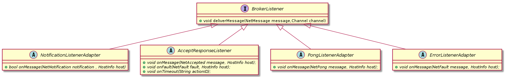

When subscribing to a message queue you must extend [NotificationListenerAdapter]().
This class gives you simple message acknowledge.

### Advanced listener acknowledge example 
 ```java
 
         final BrokerClient bk = new BrokerClient();
        
         // ... connecting ...
         
       Future<HostInfo> future = bk.subscribe("/teste/",NetAction.DestinationType.QUEUE,new BrokerListener() {
        
        
            @Override
            public void deliverMessage(NetMessage message, Channel channel) throws Throwable {
                
                    bk.acknowledge(message.getAction().getNotificationMessage());
            }
            
            
        });

 
 ```